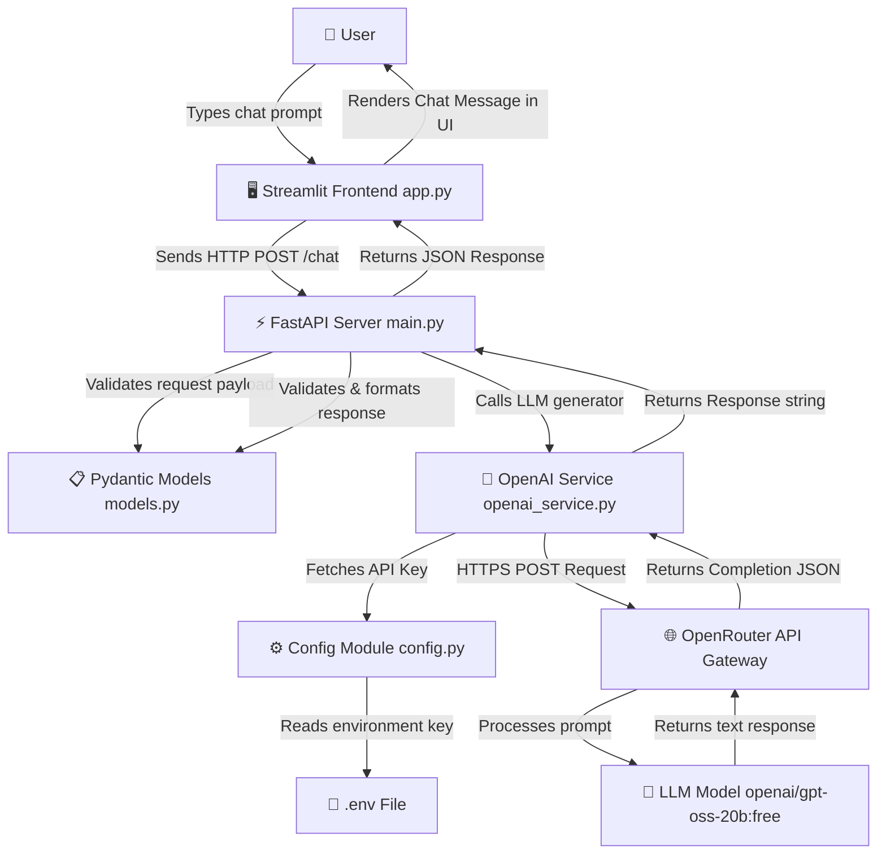

# 🤖 AI Chatbot Application

A full-stack, real-time AI Chatbot application built using **FastAPI** for the backend, **Streamlit** for the frontend, and integrated with **OpenRouter / OpenAI API** for generating intelligent responses.

---

## 📌 Project Overview

This project provides an interactive chat interface where users can ask questions and receive responses generated by AI models. 

- **Frontend**: A clean, responsive chat web application powered by Streamlit.
- **Backend**: A high-performance, asynchronous REST API powered by FastAPI.
- **AI Engine**: OpenAI Python SDK routing requests to LLM models via OpenRouter.
- **Data Validation**: Pydantic schema models to ensure type safety and payload validation.

---

## 🛠️ Technologies Used

| Layer | Technology / Library | Purpose |
|---|---|---|
| **Frontend** | [Streamlit](https://streamlit.io/) | Interactive UI rendering & chat session management |
| | [Requests](https://requests.readthedocs.io/) | HTTP client for communicating with the FastAPI backend |
| **Backend** | [FastAPI](https://fastapi.tiangolo.com/) | Modern, fast web framework for building REST APIs |
| | [Uvicorn](https://www.uvicorn.org/) | Lightning-fast ASGI server implementation |
| | [Pydantic](https://docs.pydantic.dev/) | Data parsing, validation, and schema definitions |
| **AI Integration** | [OpenAI SDK](https://github.com/openai/openai-python) | Python client for communicating with LLMs |
| | [OpenRouter API](https://openrouter.ai/) | Unified API gateway to access LLM models (e.g., `openai/gpt-oss-20b:free`) |
| **Configuration** | [python-dotenv](https://github.com/theskumar/python-dotenv) | Environment variable management from `.env` file |

---

## 🏗️ Architecture & Flow Diagram

### System Architecture & Data Flow



---

## 📂 Project Structure & File Significance

```text
Chatbot_Project/
├── .env                  # Environment variable file storing secret API keys
├── .gitignore            # Git exclusion rules
├── requirements.txt      # Project Python dependencies list
├── README.md             # Project documentation
├── backend/
│   ├── __init__.py       # Python package marker
│   ├── config.py         # Loads and validates environment settings
│   ├── main.py           # FastAPI application entry point and endpoint routes
│   ├── models.py         # Pydantic schemas for request & response validation
│   └── openai_service.py # Communicates with OpenRouter / OpenAI API
└── frontend/
    └── app.py            # Streamlit web UI application
```

### 📄 File-by-File Breakdown & Significance

#### 1. Backend Directory (`/backend`)

- **[`backend/main.py`](file:///c:/Users/Aditya%20Verma/OneDrive/Desktop/My%20Work/Chatbot_Project/backend/main.py)**
  - **Role**: Primary API Server entry point.
  - **Significance**: Initializes FastAPI app instance, registers CORS/middleware if needed, and exposes HTTP endpoints (`GET /` health check and `POST /chat`). It orchestrates receiving HTTP requests, calling `generate_response()` from `openai_service.py`, and returning the structured JSON response using `ChatResponse`.

- **[`backend/models.py`](file:///c:/Users/Aditya%20Verma/OneDrive/Desktop/My%20Work/Chatbot_Project/backend/models.py)**
  - **Role**: Data Validation & Schema Definitions.
  - **Significance**: Defines data contracts using Pydantic `BaseModel`.
    - `ChatRequest`: Validates incoming payload JSON (must contain `message: str`).
    - `ChatResponse`: Validates outgoing payload JSON (must contain `response: str`).

- **[`backend/openai_service.py`](file:///c:/Users/Aditya%20Verma/OneDrive/Desktop/My%20Work/Chatbot_Project/backend/openai_service.py)**
  - **Role**: AI LLM Communication Layer.
  - **Significance**: Configures the `OpenAI` client to point to OpenRouter (`https://openrouter.ai/api/v1`) using `OPENROUTER_API_KEY`. Contains `generate_response(message: str)` function that sends chat completion requests to the model (`openai/gpt-oss-20b:free`) and extracts text content from the completion choice.

- **[`backend/config.py`](file:///c:/Users/Aditya%20Verma/OneDrive/Desktop/My%20Work/Chatbot_Project/backend/config.py)**
  - **Role**: Environment Configuration Manager.
  - **Significance**: Uses `python-dotenv` to load secrets from `.env`. Reads `OPENROUTER_API_KEY` and validates its presence, raising a `ValueError` immediately if the key is missing to prevent silent runtime failures.

- **`backend/__init__.py`**
  - **Role**: Package Initialization.
  - **Significance**: Marks `backend` as a Python package, enabling clean relative and absolute imports across backend modules.

---

#### 2. Frontend Directory (`/frontend`)

- **[`frontend/app.py`](file:///c:/Users/Aditya%20Verma/OneDrive/Desktop/My%20Work/Chatbot_Project/frontend/app.py)**
  - **Role**: User Interface & Client App.
  - **Significance**: Renders a browser UI using Streamlit. Manages conversational chat history using `st.session_state.messages`, renders user and assistant chat bubbles (`st.chat_message`), captures prompt input (`st.chat_input`), sends HTTP POST requests using `requests.post()` to `http://127.0.0.1:8000/chat`, and handles loading states and error notifications.

---

#### 3. Root Level Files

- **[`.env`](file:///c:/Users/Aditya%20Verma/OneDrive/Desktop/My%20Work/Chatbot_Project/.env)**
  - **Role**: Environment Secrets Store.
  - **Significance**: Holds sensitive API keys (`OPENROUTER_API_KEY`). Kept separate from source code for security.

- **[`requirements.txt`](file:///c:/Users/Aditya%20Verma/OneDrive/Desktop/My%20Work/Chatbot_Project/requirements.txt)**
  - **Role**: Dependency Management.
  - **Significance**: Lists all required Python packages (`fastapi`, `uvicorn`, `openai`, `streamlit`, `python-dotenv`, `requests`) for easy workspace setup.

- **[`.gitignore`](file:///c:/Users/Aditya%20Verma/OneDrive/Desktop/My%20Work/Chatbot_Project/.gitignore)**
  - **Role**: Version Control Filter.
  - **Significance**: Prevents committing sensitive files (like `.env`) or auto-generated cache directories (like `__pycache__`) to Git repositories.

- **[`README.md`](file:///c:/Users/Aditya%20Verma/OneDrive/Desktop/My%20Work/Chatbot_Project/README.md)**
  - **Role**: Complete Documentation.
  - **Significance**: Provides developers and stakeholders with full documentation of architecture, file roles, API specifications, and installation steps.

---

## ⚡ API Specification

### 1. Health Check
- **URL**: `/`
- **Method**: `GET`
- **Response**:
  ```json
  {
    "message": "Chatbot API is running!"
  }
  ```

### 2. Chat Endpoint
- **URL**: `/chat`
- **Method**: `POST`
- **Content-Type**: `application/json`
- **Request Body**:
  ```json
  {
    "message": "Explain quantum computing in simple terms."
  }
  ```
- **Success Response (200 OK)**:
  ```json
  {
    "response": "Quantum computing uses quantum bits (qubits) to perform complex calculations much faster than classical computers..."
  }
  ```

---

## 🚀 How to Run the Project

### 1. Prerequisites
- **Python 3.10+** installed.
- An API Key from **[OpenRouter](https://openrouter.ai/)**.

### 2. Installation & Setup

1. **Clone or navigate to the project directory**:
   ```bash
   cd "c:\Users\Aditya Verma\OneDrive\Desktop\My Work\Chatbot_Project"
   ```

2. **Install Dependencies**:
   ```bash
   pip install -r requirements.txt
   ```

3. **Configure Environment Variables**:
   Ensure a `.env` file exists in the root directory with your OpenRouter key:
   ```env
   OPENROUTER_API_KEY=your_actual_api_key_here
   ```

---

### 3. Launching Application Services

#### Step 1: Start Backend Server (FastAPI)
Open a terminal and run:
```bash
cd backend
uvicorn main:app --reload
```
- API Base URL: `http://127.0.0.1:8000`
- Interactive Swagger UI: `http://127.0.0.1:8000/docs`

#### Step 2: Start Frontend UI (Streamlit)
Open a second terminal window and run:
```bash
cd frontend
streamlit run app.py
```
- Web Application URL: `http://localhost:8501`

---

## 🛣️ Project Evolution & Roadmap

- [x] **Level 1**: Basic FastAPI web server setup.
- [x] **Level 2**: `POST /chat` endpoint implementation.
- [x] **Level 3**: OpenRouter & OpenAI SDK connection.
- [x] **Level 4**: Pydantic models & request validation.
- [x] **Level 5**: Streamlit frontend chat UI integration.
- [ ] **Level 6**: Streaming responses (SSE / WebSockets).
- [ ] **Level 7**: Chat memory & conversation context window.
- [ ] **Level 8**: User authentication & Database history persistence.